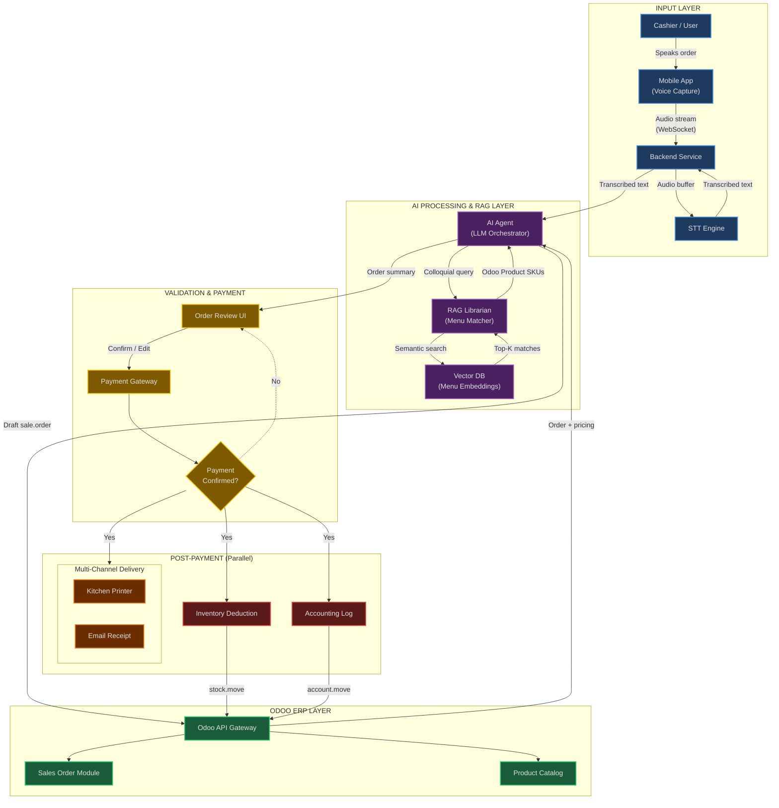
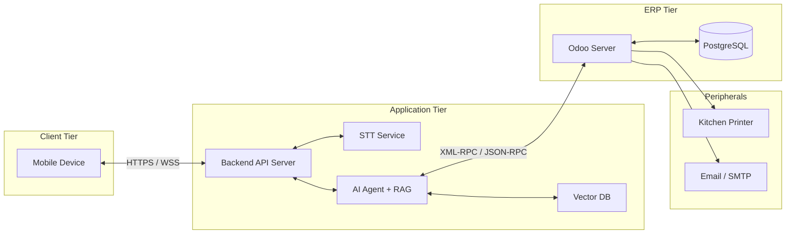

# Architecture — AI-Powered Cashier System with Odoo Integration

## Table of Contents

- [Overview](#overview)
- [System Architecture Diagram](#system-architecture-diagram)
- [Sequence Diagram](#sequence-diagram)
- [Layer Breakdown](#layer-breakdown)
- [Data Flow Summary](#data-flow-summary)
- [Deployment Topology](#deployment-topology)
- [Technology Stack](#technology-stack)
- [Related Documents](#related-documents)

---

## Overview

This system is an AI-powered Point-of-Sale cashier that accepts voice input from a mobile app, uses Speech-to-Text and a RAG-based menu matcher to resolve spoken food orders into structured Odoo product SKUs, creates sales orders via the Odoo ERP API, and executes post-payment workflows (inventory deduction, accounting logs, receipt delivery) in parallel.

**Key design principles:**

- Voice-first UX — cashiers never manually search menus
- RAG-based fuzzy matching — handles colloquial and regional food names
- Odoo-native — all business logic (sales, inventory, accounting) lives in Odoo
- Parallel post-payment — inventory, accounting, and delivery execute concurrently

---

## System Architecture Diagram



---

## Sequence Diagram

```mermaid
sequenceDiagram
    autonumber

    actor Cashier as Cashier
    participant App as Mobile App
    participant Backend as Backend
    participant STT as STT Engine
    participant Agent as AI Agent
    participant Librarian as RAG Librarian
    participant VectorDB as Vector DB
    participant Odoo as Odoo ERP
    participant Payment as Payment
    participant Inventory as Inventory
    participant Accounting as Accounting
    participant Kitchen as Kitchen Printer
    participant Email as Email Service

    rect rgb(30, 58, 95)
        Note over Cashier, STT: Phase 1 — Voice Input
        Cashier ->> App: Speaks food order
        App ->> Backend: Stream audio (WebSocket)
        Backend ->> STT: Forward audio
        STT -->> Backend: Transcribed text
    end

    rect rgb(74, 32, 96)
        Note over Backend, VectorDB: Phase 2 — AI + RAG
        Backend ->> Agent: Send text
        Agent ->> Librarian: Query colloquial terms
        Librarian ->> VectorDB: Semantic search
        VectorDB -->> Librarian: Top-K matches
        Librarian -->> Agent: Resolved SKUs
    end

    rect rgb(26, 92, 58)
        Note over Agent, Odoo: Phase 3 — Odoo Order
        Agent ->> Odoo: Create draft sale.order
        Odoo -->> Agent: Order ID + pricing
        Agent -->> App: Order summary
    end

    rect rgb(125, 90, 0)
        Note over Cashier, Payment: Phase 4 — Validation
        App ->> Cashier: Display order
        Cashier ->> App: Confirm or edit

        alt Order edited
            App ->> Agent: Send corrections
            Agent ->> Odoo: Update sale.order
            Odoo -->> Agent: Updated order
            Agent -->> App: Refreshed summary
        end

        App ->> Payment: Process payment
        Payment -->> App: Payment result

        alt Payment failed
            App ->> Cashier: Show error, retry
        end
    end

    rect rgb(90, 26, 26)
        Note over Odoo, Email: Phase 5 — Post-Payment
        App ->> Odoo: Confirm sale.order

        par Inventory
            Odoo ->> Inventory: stock.move deduction
            Inventory -->> Odoo: Done
        and Accounting
            Odoo ->> Accounting: account.move entry
            Accounting -->> Odoo: Done
        and Delivery
            Odoo ->> Kitchen: ESC/POS print
            Kitchen -->> Odoo: Done
            Odoo ->> Email: Send receipt
            Email -->> Odoo: Done
        end

        Odoo -->> App: Complete
        App ->> Cashier: Success
    end
```



---

## Layer Breakdown

### Layer 1 — Input (Mobile App & Backend)

| Component | Responsibility |
|---|---|
| **Mobile App** | Captures voice via microphone, streams audio over WebSocket, displays order UI |
| **Backend Service** | Receives audio stream, forwards to STT, returns transcription to AI Agent |
| **STT Engine** | Converts raw audio into text — supports Bahasa Indonesia and regional dialects |

### Layer 2 — AI Processing & RAG

| Component | Responsibility |
|---|---|
| **AI Agent** | Orchestrates the full pipeline — parses intent, calls Librarian, builds Odoo order payloads |
| **RAG Librarian** | Maps colloquial food names to official Odoo product SKUs via semantic similarity |
| **Vector DB** | Stores menu item embeddings; serves nearest-neighbor queries |

### Layer 3 — Odoo ERP Integration

| Component | Responsibility |
|---|---|
| **Odoo API Gateway** | XML-RPC / JSON-RPC interface to Odoo models |
| **Sales Order Module** | `sale.order` and `sale.order.line` management |
| **Product Catalog** | `product.product` and `product.template` with SKU mappings |

### Layer 4 — Validation & Payment

| Component | Responsibility |
|---|---|
| **Order Review UI** | Displays structured order for cashier confirmation or editing |
| **Payment Gateway** | Processes payment via POS hardware, QRIS, or digital wallet |

### Layer 5 — Post-Payment Execution

| Component | Responsibility |
|---|---|
| **Inventory Deduction** | Creates `stock.move` to decrement product quantities |
| **Accounting Log** | Creates `account.move` journal entries for revenue recognition |
| **Kitchen Printer** | Sends ESC/POS commands to thermal printer over network |
| **Email Receipt** | Sends formatted HTML receipt to customer email |

---

## Data Flow Summary

```
Voice Audio
  → WebSocket stream to Backend
    → STT Engine transcription
      → AI Agent intent parsing
        → RAG Librarian SKU resolution (Vector DB lookup)
          → Odoo API: draft sale.order
            → Mobile App: order review
              → Payment Gateway
                → Odoo API: confirm sale.order
                  ├── stock.move (inventory)
                  ├── account.move (accounting)
                  ├── ESC/POS (kitchen printer)
                  └── SMTP (email receipt)
```

---

## Deployment Topology



---

## Technology Stack

| Category | Technology | Notes |
|---|---|---|
| Mobile App | Flutter / React Native | Cross-platform, voice capture support |
| Backend API | FastAPI (Python) | Async WebSocket support, high performance |
| STT Engine | OpenAI Whisper / Google Cloud STT | Whisper for on-prem, Google for managed |
| AI Agent | LangChain + LLM (Gemini / GPT) | Orchestration framework |
| RAG / Embeddings | LlamaIndex or LangChain RAG | Document/menu retrieval |
| Vector DB | ChromaDB / Qdrant / Pinecone | Embedding storage and search |
| ERP | Odoo 17+ Community | Sales, inventory, accounting, POS |
| Database | PostgreSQL | Odoo's default RDBMS |
| Payment | Midtrans / Xendit / Odoo POS | Indonesia-focused payment options |
| Kitchen Printer | ESC/POS over TCP/USB | Thermal receipt printing |
| Email | SMTP / SendGrid / Mailgun | Transactional email delivery |
| Deployment | Docker + Docker Compose | Containerized services |

---

## Related Documents

| Document | Path | Description |
|---|---|---|
| API Specification | [`docs/API.md`](file:///d:/AMD-Lomba/docs/API.md) | REST & WebSocket endpoint contracts |
| Database Schema | [`docs/Database-Schema.md`](file:///d:/AMD-Lomba/docs/Database-Schema.md) | Odoo model extensions and Vector DB schema |
| RAG Pipeline | [`docs/RAG-Pipeline.md`](file:///d:/AMD-Lomba/docs/RAG-Pipeline.md) | Menu embedding strategy and retrieval flow |
| Deployment Guide | [`docs/Deployment.md`](file:///d:/AMD-Lomba/docs/Deployment.md) | Docker Compose setup and environment config |
| Project README | [`README.md`](file:///d:/AMD-Lomba/README.md) | Quick start and project overview |
