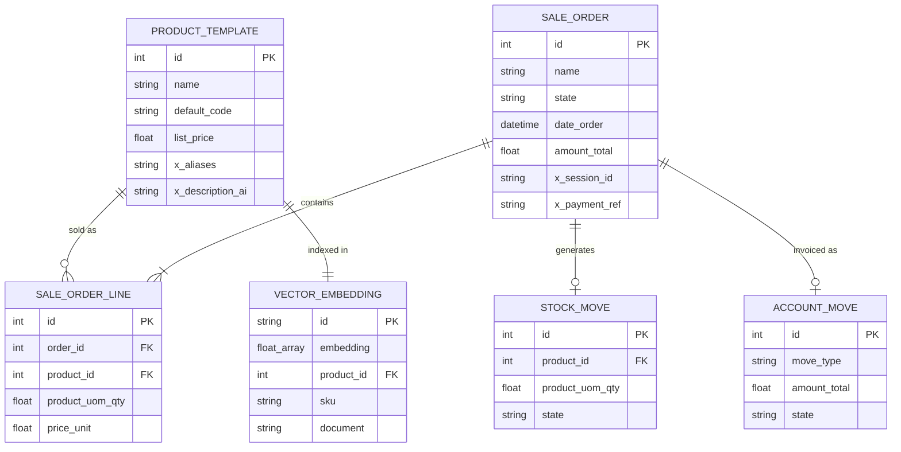

# Database Schema

## Overview

The system uses two database layers:
1. **PostgreSQL** — Odoo's relational database for sales, inventory, accounting, and product data.
2. **Vector DB (ChromaDB)** — Stores menu item embeddings for RAG-based semantic search.

---

## 1. Odoo Models (PostgreSQL)

### product.template (Extended)

Standard Odoo product model with custom fields for the AI cashier.

| Field | Type | Description |
|---|---|---|
| `id` | integer | Primary key |
| `name` | char | Official product name |
| `default_code` | char | SKU code (e.g., `FOOD-NG-001`) |
| `list_price` | float | Selling price |
| `categ_id` | many2one | Product category |
| `x_aliases` | text | Comma-separated colloquial aliases (custom field) |
| `x_description_ai` | text | Extended description for embedding generation (custom field) |
| `active` | boolean | Whether product is available |

### sale.order

| Field | Type | Description |
|---|---|---|
| `id` | integer | Primary key |
| `name` | char | Order reference (e.g., `ORD-2026-0001`) |
| `partner_id` | many2one | Customer reference |
| `state` | selection | `draft` / `sale` / `cancel` |
| `date_order` | datetime | Order timestamp |
| `amount_total` | float | Total order amount |
| `x_session_id` | char | AI session ID linking to voice session (custom field) |
| `x_payment_ref` | char | Payment transaction reference (custom field) |

### sale.order.line

| Field | Type | Description |
|---|---|---|
| `id` | integer | Primary key |
| `order_id` | many2one | Parent sale.order |
| `product_id` | many2one | Product reference |
| `product_uom_qty` | float | Quantity ordered |
| `price_unit` | float | Unit price |
| `price_subtotal` | float | Line subtotal |

### stock.move (Auto-generated)

Created automatically when `sale.order` is confirmed. Handles inventory deduction.

| Field | Type | Description |
|---|---|---|
| `product_id` | many2one | Product being moved |
| `product_uom_qty` | float | Quantity to deduct |
| `location_id` | many2one | Source location (stock) |
| `location_dest_id` | many2one | Destination (customer) |
| `state` | selection | `draft` / `confirmed` / `done` |

### account.move (Auto-generated)

Created for accounting/journal entry when order is invoiced.

| Field | Type | Description |
|---|---|---|
| `move_type` | selection | `out_invoice` for sales |
| `partner_id` | many2one | Customer |
| `amount_total` | float | Invoice total |
| `state` | selection | `draft` / `posted` |

---

## 2. Vector DB Schema (ChromaDB)

### Collection: `menu_items`

| Field | Type | Description |
|---|---|---|
| `id` | string | `"product_{odoo_product_id}"` |
| `embedding` | float[] | 768/1536-dim vector (depends on model) |
| `metadata.product_id` | integer | Odoo `product.product` ID |
| `metadata.sku` | string | Product SKU code |
| `metadata.name` | string | Official product name |
| `metadata.aliases` | string | Colloquial names, comma-separated |
| `metadata.category` | string | Product category name |
| `metadata.price` | float | Current selling price |
| `document` | string | Concatenated text used for embedding generation |

#### Embedding Document Format

```
{name} | {aliases} | {category} | {description_ai}
```

Example:
```
Nasi Goreng Spesial | nasgor spesial, nasi goreng special, nasgor | Makanan Utama | Nasi goreng dengan telur, ayam, dan sayuran, disajikan dengan kerupuk
```

---

## 3. Entity Relationship


