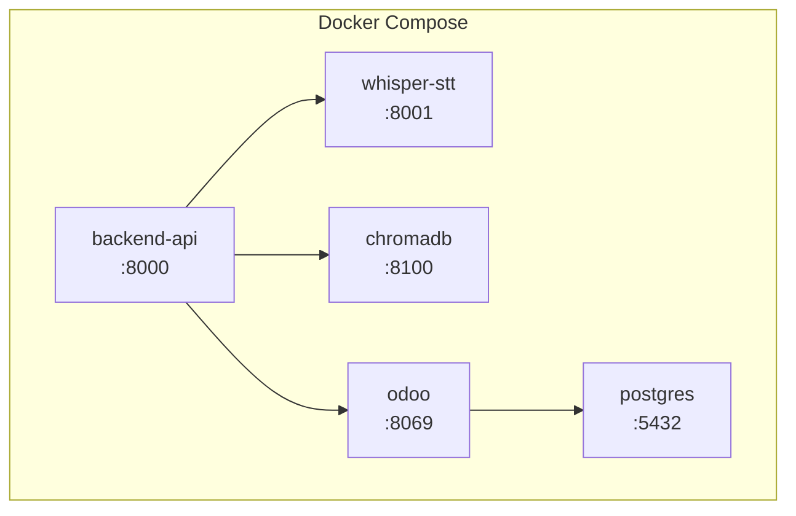

# Deployment Guide

## Overview

All services are containerized with Docker and orchestrated via Docker Compose. This guide covers local development setup and production deployment considerations.

---

## Service Architecture



---

## Docker Compose

```yaml
# docker-compose.yml
version: '3.8'

services:
  backend-api:
    build: ./backend
    ports:
      - "8000:8000"
    environment:
      - STT_SERVICE_URL=http://whisper-stt:8001
      - CHROMA_HOST=chromadb
      - CHROMA_PORT=8100
      - ODOO_URL=http://odoo:8069
      - ODOO_DB=${ODOO_DB}
      - ODOO_USER=${ODOO_USER}
      - ODOO_PASSWORD=${ODOO_PASSWORD}
      - LLM_API_KEY=${LLM_API_KEY}
      - LLM_MODEL=${LLM_MODEL}
      - EMBEDDING_MODEL=${EMBEDDING_MODEL}
      - PAYMENT_API_KEY=${PAYMENT_API_KEY}
      - SMTP_HOST=${SMTP_HOST}
      - SMTP_PORT=${SMTP_PORT}
      - SMTP_USER=${SMTP_USER}
      - SMTP_PASSWORD=${SMTP_PASSWORD}
    depends_on:
      - whisper-stt
      - chromadb
      - odoo
    restart: unless-stopped

  whisper-stt:
    image: onerahmet/openai-whisper-asr-webservice:latest
    ports:
      - "8001:9000"
    environment:
      - ASR_MODEL=base
      - ASR_ENGINE=openai_whisper
    restart: unless-stopped

  chromadb:
    image: chromadb/chroma:latest
    ports:
      - "8100:8000"
    volumes:
      - chroma_data:/chroma/chroma
    restart: unless-stopped

  odoo:
    image: odoo:17.0
    ports:
      - "8069:8069"
    environment:
      - HOST=postgres
      - USER=${ODOO_DB_USER:-odoo}
      - PASSWORD=${ODOO_DB_PASSWORD:-odoo}
    volumes:
      - odoo_data:/var/lib/odoo
      - ./odoo/addons:/mnt/extra-addons
    depends_on:
      - postgres
    restart: unless-stopped

  postgres:
    image: postgres:15
    ports:
      - "5432:5432"
    environment:
      - POSTGRES_DB=${ODOO_DB:-odoo}
      - POSTGRES_USER=${ODOO_DB_USER:-odoo}
      - POSTGRES_PASSWORD=${ODOO_DB_PASSWORD:-odoo}
    volumes:
      - postgres_data:/var/lib/postgresql/data
    restart: unless-stopped

volumes:
  chroma_data:
  odoo_data:
  postgres_data:
```

---

## Environment Variables

Create a `.env` file from the template:

```bash
cp .env.example .env
```

### Required Variables

| Variable | Description | Example |
|---|---|---|
| `ODOO_DB` | Odoo database name | `odoo_cashier` |
| `ODOO_USER` | Odoo admin username | `admin` |
| `ODOO_PASSWORD` | Odoo admin password | `admin` |
| `LLM_API_KEY` | API key for LLM provider | `sk-...` or Gemini key |
| `LLM_MODEL` | LLM model identifier | `gemini-2.0-flash` |
| `EMBEDDING_MODEL` | Embedding model name | `intfloat/multilingual-e5-base` |
| `PAYMENT_API_KEY` | Payment gateway API key | `Mid-server-...` |

### Optional Variables

| Variable | Description | Default |
|---|---|---|
| `ODOO_DB_USER` | PostgreSQL user | `odoo` |
| `ODOO_DB_PASSWORD` | PostgreSQL password | `odoo` |
| `SMTP_HOST` | Email SMTP server | `smtp.gmail.com` |
| `SMTP_PORT` | SMTP port | `587` |
| `SMTP_USER` | SMTP username | — |
| `SMTP_PASSWORD` | SMTP password | — |
| `PRINTER_IP` | Kitchen printer IP | `192.168.1.100` |
| `PRINTER_PORT` | Kitchen printer port | `9100` |

---

## .env.example

```env
# Odoo
ODOO_DB=odoo_cashier
ODOO_USER=admin
ODOO_PASSWORD=admin
ODOO_DB_USER=odoo
ODOO_DB_PASSWORD=odoo

# AI / LLM
LLM_API_KEY=your_api_key_here
LLM_MODEL=gemini-2.0-flash
EMBEDDING_MODEL=intfloat/multilingual-e5-base

# Payment
PAYMENT_API_KEY=your_payment_key_here

# Email
SMTP_HOST=smtp.gmail.com
SMTP_PORT=587
SMTP_USER=your_email@gmail.com
SMTP_PASSWORD=your_app_password

# Printer
PRINTER_IP=192.168.1.100
PRINTER_PORT=9100
```

---

## Setup Steps

### 1. Start all services

```bash
docker-compose up -d
```

### 2. Initialize Odoo

1. Access `http://localhost:8069`
2. Create a new database (use the name from `ODOO_DB`)
3. Install modules: **Sales**, **Inventory**, **Accounting**, **Point of Sale**
4. Add custom fields to Product model:
   - `x_aliases` (Text) — Colloquial name variants
   - `x_description_ai` (Text) — Extended AI-friendly description

### 3. Add products in Odoo

Populate the product catalog with menu items, SKUs, prices, and aliases.

### 4. Seed the vector database

```bash
docker exec -it backend-api python scripts/seed_menu_embeddings.py
```

### 5. Verify health

```bash
curl http://localhost:8000/api/v1/health
```

---

## Production Considerations

### Scaling

- **Backend API**: Run multiple replicas behind a load balancer (Nginx / Traefik)
- **Whisper STT**: GPU-accelerated container for production throughput
- **ChromaDB**: Consider migrating to Qdrant or Pinecone for high availability
- **Odoo**: Standard Odoo scaling with worker processes

### Security

- Use HTTPS/WSS for all connections
- Store secrets in a vault (e.g., HashiCorp Vault, AWS Secrets Manager)
- Restrict Odoo API access to backend service IPs only
- Enable rate limiting on the API gateway

### Monitoring

| Metric | Tool |
|---|---|
| API latency & errors | Prometheus + Grafana |
| STT accuracy | Custom logging dashboard |
| RAG miss rate | Application logs (items below threshold) |
| Odoo performance | Odoo built-in profiler |
| Container health | Docker healthchecks |

### Backup

- PostgreSQL: daily `pg_dump` with offsite storage
- ChromaDB: volume snapshots (or re-seed from Odoo on recovery)
- Odoo filestore: volume backup
