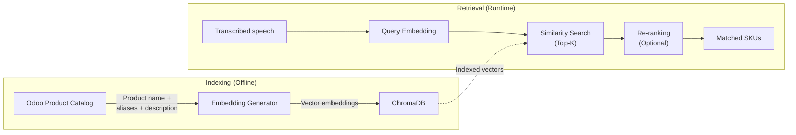
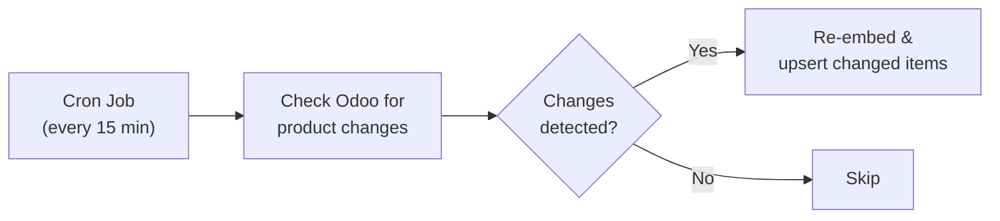

# RAG Pipeline — Menu Matching

## Overview

The RAG (Retrieval-Augmented Generation) pipeline is the core intelligence layer that maps colloquial spoken food names to official Odoo product SKUs. It uses vector similarity search to handle abbreviations, regional names, and informal speech patterns.

---

## Pipeline Flow



---

## Indexing Strategy

### 1. Data Source

Products are pulled from Odoo via XML-RPC:

```python
products = odoo.execute_kw(
    'product.product', 'search_read',
    [[['active', '=', True], ['sale_ok', '=', True]]],
    {'fields': ['name', 'default_code', 'list_price', 'categ_id',
                'x_aliases', 'x_description_ai']}
)
```

### 2. Document Construction

Each product is converted to a searchable text document:

```python
def build_document(product: dict) -> str:
    parts = [
        product['name'],
        product.get('x_aliases', ''),
        product['categ_id'][1] if product.get('categ_id') else '',
        product.get('x_description_ai', '')
    ]
    return ' | '.join(filter(None, parts))
```

Example output:
```
Nasi Goreng Spesial | nasgor spesial, nasi goreng special, nasgor | Makanan Utama | Nasi goreng dengan telur, ayam, dan sayuran
```

### 3. Embedding Model

| Option | Dimensions | Pros | Cons |
|---|---|---|---|
| `text-embedding-3-small` (OpenAI) | 1536 | High quality, multilingual | API cost |
| `all-MiniLM-L6-v2` (Sentence Transformers) | 384 | Free, fast, local | Lower quality for Bahasa |
| `intfloat/multilingual-e5-base` | 768 | Good Bahasa support, free | Moderate speed |

**Recommended:** `intfloat/multilingual-e5-base` for best balance of Bahasa Indonesia support and cost.

### 4. Indexing Script

```python
# scripts/seed_menu_embeddings.py
import chromadb
from sentence_transformers import SentenceTransformer

model = SentenceTransformer('intfloat/multilingual-e5-base')
client = chromadb.HttpClient(host='localhost', port=8100)
collection = client.get_or_create_collection('menu_items')

for product in products:
    doc = build_document(product)
    embedding = model.encode(f"passage: {doc}").tolist()

    collection.upsert(
        ids=[f"product_{product['id']}"],
        embeddings=[embedding],
        documents=[doc],
        metadatas=[{
            'product_id': product['id'],
            'sku': product['default_code'],
            'name': product['name'],
            'price': product['list_price'],
            'category': product['categ_id'][1]
        }]
    )
```

---

## Retrieval Flow

### 1. Query Processing

The AI Agent sends the transcribed speech chunk to the Librarian:

```python
async def match_items(transcribed_text: str) -> list[MatchedItem]:
    query_embedding = model.encode(f"query: {transcribed_text}").tolist()

    results = collection.query(
        query_embeddings=[query_embedding],
        n_results=5,
        include=['metadatas', 'distances', 'documents']
    )

    return parse_results(results, threshold=0.35)
```

### 2. Similarity Threshold

| Distance | Interpretation | Action |
|---|---|---|
| < 0.25 | High confidence match | Auto-select |
| 0.25 – 0.45 | Probable match | Present to AI Agent for validation |
| > 0.45 | Low confidence | Ask cashier for clarification |

### 3. Multi-item Resolution

Spoken orders often contain multiple items in one sentence:

```
"satu nasgor spesial sama dua es teh manis"
```

The AI Agent is responsible for:
1. Parsing quantity + item pairs from the transcription
2. Sending each item separately to the Librarian
3. Aggregating results into a single order

---

## Menu Sync Schedule



- Sync runs every 15 minutes via a background task
- Only changed/new products are re-embedded (delta sync)
- Deleted products are removed from the vector store
- Full re-index can be triggered manually via `POST /api/v1/admin/reindex`

---

## Tuning Recommendations

1. **Aliases are critical** — populate `x_aliases` in Odoo with as many colloquial variants as possible
2. **Test with real speech** — transcription errors (e.g., "nasgor" → "nas gor") must be handled by embeddings
3. **Monitor miss rates** — log queries that fall below the similarity threshold for alias improvement
4. **Consider hybrid search** — combine vector similarity with keyword BM25 for better recall on exact matches
